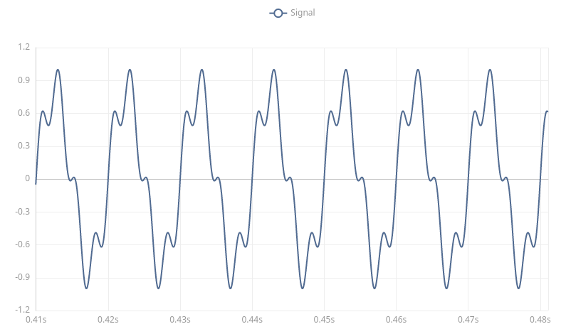
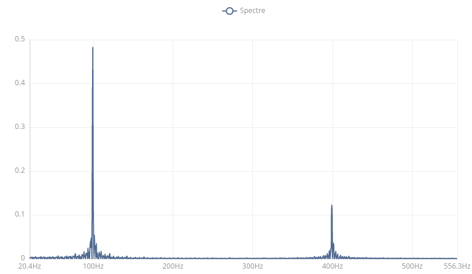

# Calcul de la transformée de Fourier

Ce programme de démonstration montre comment calculer puis afficher la
transformée de Fourierd'un signal (en réalité l'application de
l'algorithme numérique FFT).

Le prgramme crée un signal composé d'une fréquence f et d'un de ces
harmoniques (voir fichier [main.go](main.go)), puis en calcul la FFT,
produit les tracés graphiques de la série temporelle du signal et de sa
FFT, puis joue le signal sous la forme d'un son.

Image de la série temporelle (zoom sur quelques cycles):

Image de la transformée de Fourier:

